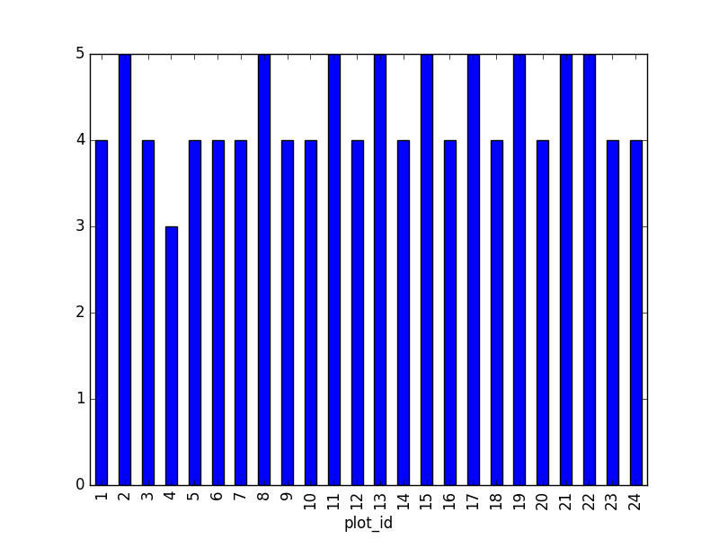
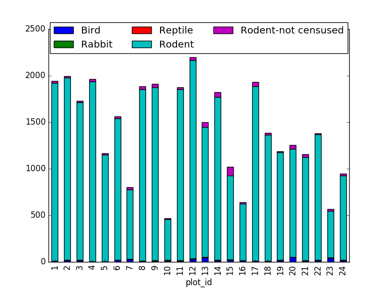
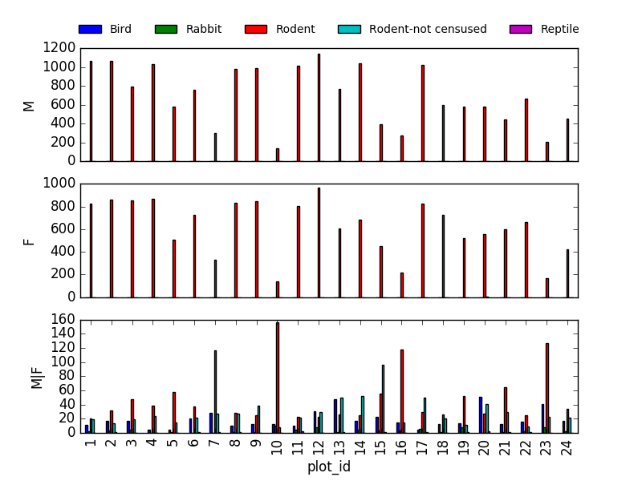

# Challenge solutions

## Install the required workshop packages

Please use the instructions in the [Setup][lesson-setup] document to perform installs. If you
encounter setup issues, please file an issue with the tags 'High-priority'.

## Checking installations.

In the [`episodes/files/scripts/check_env.py`](../episodes/files/scripts/check_env.py) directory, you will find a script called check\_env.py This checks the
functionality of the Anaconda install.

By default, Data Carpentry does not have people pull the whole repository with all the scripts and
addenda. Therefore, you, as the instructor, get to decide how you'd like to provide this script to
learners, if at all.  To use this, students can navigate into `_includes/scripts` in the terminal, and
execute the following:

```bash
python check_env.py
```

If learners receive an `AssertionError`, it will inform you how to help them correct this
installation. Otherwise, it will tell you that the system is good to go and ready for Data
Carpentry!


## 02-starting-with-data

:::::::::::::::::::::::::::::::::::::::::  callout

## Important Bug Note

In Pandas prior to 0.18.1 there is a bug causing `surveys_df['weight'].describe()` to return
a runtime error.

::::::::::::::::::::::::::::::::::::::::::::::::::

## 03-index-slice-subset

Tip: use `.head()` method throughout this lesson to keep your display neater for students.
Encourage students to try with and without `.head()` to reinforce this useful tool and then to use
it or not at their preference. For example, if a student worries about keeping up in pace with
typing, let them know they can skip the `.head()`, but that you'll use it to keep more lines of
previous steps visible.

## 04-data-types-and-format

### Writing Out Data to CSV

If the students have trouble generating the output, or anything happens with that, the folder
[`sample_output`](https://github.com/datacarpentry/python-ecology-lesson/tree/main/sample_output)
in this repository contains the file `surveys_complete.csv` with the data they should generate.

## 05-merging-data

- In the data folder, there are two survey data files: survey2001.csv and survey2002.csv. Read the
  data into Python and combine the files to make one new data frame. Create a plot of average plot
  weight by year grouped by sex. Export your results as a CSV and make sure it reads back into
  Python properly.

```python
# read the files:
survey2001 = pd.read_csv("data/survey2001.csv")
survey2002 = pd.read_csv("data/survey2002.csv")
# concatenate
survey_all = pd.concat([survey2001, survey2002], axis=0)
# get the weight for each year, grouped by sex:
weight_year = survey_all.groupby(['year', 'sex']).mean()["wgt"].unstack()
# plot:
weight_year.plot(kind="bar")
plt.tight_layout()  # tip(!)
```

{alt='average weight for each year, grouped by sex'}

```python
# writing to file:
weight_year.to_csv("weight_for_year.csv")
# reading it back in:
pd.read_csv("weight_for_year.csv", index_col=0)
```

- Create a new DataFrame by joining the contents of the surveys.csv and species.csv tables.

```python
merged_left = pd.merge(left=surveys_df,right=species_df, how='left', on="species_id")
```

Then calculate and plot the distribution of:

**1\. taxa per plot** (number of species of each taxa per plot):

Species distribution (number of taxa for each plot) can be derived as follows:

```python
merged_left.groupby(["plot_id"])["taxa"].nunique().plot(kind='bar')
```

{alt='taxa per plot'}

*Suggestion*: It is also possible to plot the number of individuals for each taxa in each plot
(stacked bar chart):

```python
merged_left.groupby(["plot_id", "taxa"]).count()["record_id"].unstack().plot(kind='bar', stacked=True)
plt.legend(loc='upper center', ncol=3, bbox_to_anchor=(0.5, 1.05))
```

(the legend otherwise overlaps the bar plot)

{alt='taxa per plot'}

**2\. taxa by sex by plot**:
Providing the Nan values with the M|F values (can also already be changed to 'x'):

```python
merged_left.loc[merged_left["sex"].isnull(), "sex"] = 'M|F'
```

Number of taxa for each plot/sex combination:

```python
ntaxa_sex_site= merged_left.groupby(["plot_id", "sex"])["taxa"].nunique().reset_index(level=1)
ntaxa_sex_site = ntaxa_sex_site.pivot_table(values="taxa", columns="sex", index=ntaxa_sex_site.index)
ntaxa_sex_site.plot(kind="bar", legend=False)
plt.legend(loc='upper center', ncol=3, bbox_to_anchor=(0.5, 1.08),
           fontsize='small', frameon=False)
```

{alt='taxa per plot per sex'}

*Suggestion (for discussion only)*:

The number of individuals for each taxa in each plot per sex can be derived as well.

```python
sex_taxa_site  = merged_left.groupby(["plot_id", "taxa", "sex"]).count()['record_id']
sex_taxa_site.unstack(level=[1, 2]).plot(kind='bar', logy=True)
plt.legend(loc='upper center', ncol=3, bbox_to_anchor=(0.5, 1.15),
           fontsize='small', frameon=False)
```

{alt='taxa per plot per sex'}

This is not really the best plot choice: not readable,... A first option to make this better, is to
make facets. However, pandas/matplotlib do not provide this by default. Just as a pure matplotlib
example (`M|F` if for not-defined sex records):

```python
fig, axs = plt.subplots(3, 1)
for sex, ax in zip(["M", "F", "M|F"], axs):
    sex_taxa_site[sex_taxa_site["sex"] == sex].plot(kind='bar', ax=ax, legend=False)
    ax.set_ylabel(sex)
    if not ax.is_last_row():
        ax.set_xticks([])
        ax.set_xlabel("")
axs[0].legend(loc='upper center', ncol=5, bbox_to_anchor=(0.5, 1.3),
              fontsize='small', frameon=False)
```

{alt='taxa per plot per sex'}

However, it would be better to link to [Seaborn][seaborn] and [Altair][altair] for its kind of
multivariate visualisations.

- In the data folder, there is a plot CSV that contains information about the type associated with
  each plot. Use that data to summarize the number of plots by plot type.

```python
plot_info = pd.read_csv("data/plots.csv")
plot_info.groupby("plot_type").count()
```

- Calculate a diversity index of your choice for control vs rodent exclosure plots. The index should
  consider both species abundance and number of species. You might choose the simple biodiversity
  index described here which calculates diversity as `the number of species in the plot / the total number of individuals in the plot = Biodiversity index.`

```python
merged_site_type = pd.merge(merged_left, plot_info, on='plot_id')
# For each plot, get the number of species for each plot
nspecies_site = merged_site_type.groupby(["plot_id"])["species"].nunique().rename("nspecies")
# For each plot, get the number of individuals
nindividuals_site = merged_site_type.groupby(["plot_id"]).count()['record_id'].rename("nindiv")
# combine the two series
diversity_index = pd.concat([nspecies_site, nindividuals_site], axis=1)
# calculate the diversity index
diversity_index['diversity'] = diversity_index['nspecies']/diversity_index['nindiv']
```

Making a bar chart:

```python
diversity_index['diversity'].plot(kind="barh")
plt.xlabel("Diversity index")
```

{alt='taxa per plot per sex'}

## 07-visualization-ggplot-python

Note `plotnine` contains a *lot* of deprecation warnings in some versions of python/matplotlib, warnings may need to be supressed with

```python
import warnings
warnings.filterwarnings(action='once')
```

iPython notebooks for plotting can be viewed in the `learners` folder.

## 08-putting-it-all-together

Answers are embedded with challenges in this lesson, other than random distribtuion which is left to the learner to choose, and final plot, for which the learner should investigate the matplotlib gallery.

Scientists often operate on mathematical equations. Being able to use them in their graphics has a
lot of added value. Luckily, Matplotlib provides powerful tools for text control. One of them is the
ability to use LaTeX mathematical notation, whenever text is used (you can learn more about LaTeX
math notation here: [https://en.wikibooks.org/wiki/LaTeX/Mathematics](https://en.wikibooks.org/wiki/LaTeX/Mathematics)). To use mathematical
notation, surround your text using the dollar sign ("$").  LaTeX uses the backslash character ("\\")
a lot. Since backslash has a special meaning in the Python strings, you should replace all the
LaTeX-related backslashes with two backslashes.

```python
plt.plot(t, t, 'r--', label='$y=x$')
plt.plot(t, t**2 , 'bs-', label='$y=x^2$')
plt.plot(t, (t - 5)**2 + 5 * t - 0.5, 'g^:', label='$y=(x - 5)^2 + 5  x - \\frac{1}{2}$') # note the double backslash

plt.legend(loc='upper left', shadow=True, fontsize='x-large')

# Note the double backslashes in the line below.
plt.xlabel('This is the x axis. It can also contain math such as $\\bar{x}=\\frac{\\sum_{i=1}^{n} {x}} {N}$')
plt.ylabel('This is the y axis')
plt.title('This is the figure title')

plt.show()
```

[This page][matplotlib-mathtext] contains more information.

[seaborn]: https://stanford.edu/~mwaskom/software/seaborn
[altair]: https://github.com/ellisonbg/altair
[matplotlib-mathtext]: https://matplotlib.org/users/mathtext.html


